# 🖥️ Active Directory Help Desk Home Lab


---

# Overview

This project simulates a real-world Help Desk and IT Support environment using:

- Windows Server 2025
- Active Directory Domain Services (AD DS)
- DNS
- Group Policy
- Windows 11 Client
- File Shares
- PowerShell Administration

The lab demonstrates common Help Desk tasks including:

- User account management
- Password resets
- Account unlocks
- Security group administration
- Group Policy deployment
- Shared folder permissions
- DNS troubleshooting
- PowerShell reporting

---

# Lab Architecture

## Environment

```text
+----------------------------+
| DC01                       |
| Windows Server 2025        |
| Active Directory           |
| DNS                        |
| File Shares                |
| Group Policy               |
+-------------+--------------+
              |
              |
              |
+-------------v--------------+
| CLIENT01                   |
| Windows 11 Pro            |
| Domain Joined             |
| User Testing              |
+---------------------------+
```

---

## Lab Architecture Screenshot

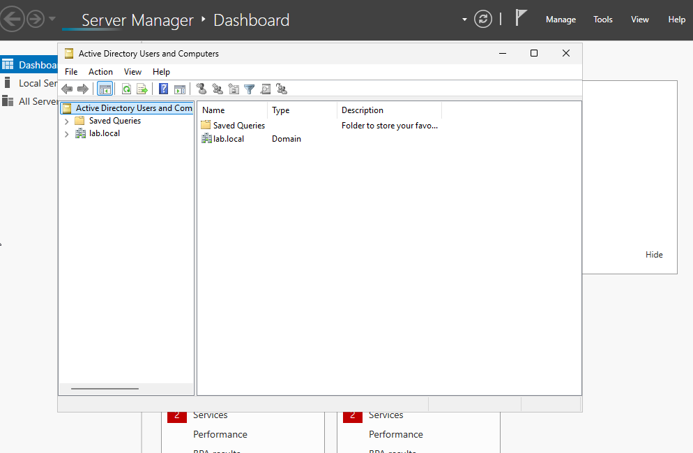

---

# Active Directory Structure

Created a dedicated Help Desk organizational structure.

### Organizational Units

- Users
- Computers
- Groups
- Disabled-Users
- Service-Accounts

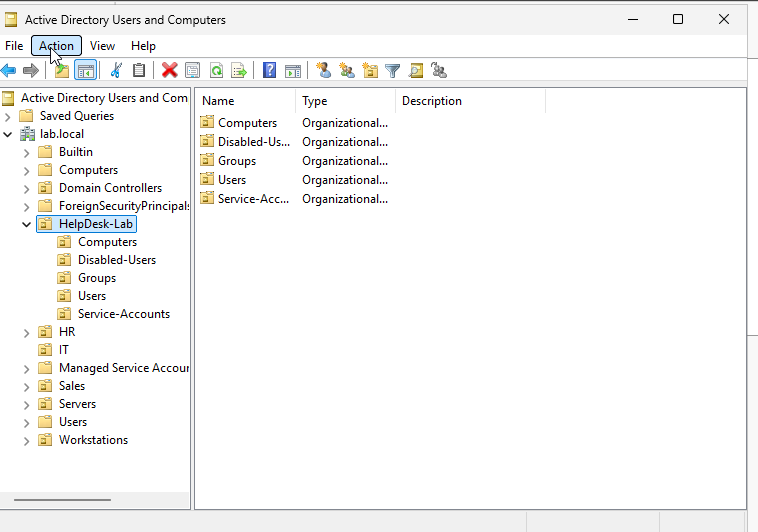

---

# User Administration

Created and managed user accounts:

- John Helpdesk
- Sarah Support
- Mike User
- Lisa User

### Skills Demonstrated

- User creation
- User management
- User administration
- Active Directory administration

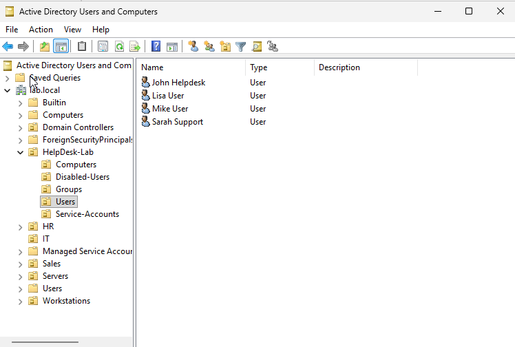

---

# Security Groups

Created security groups for access management:

- HelpDesk_Tier1
- FileShare_Access
- Printer_Access
- VPN_Users

### Skills Demonstrated

- RBAC
- Security groups
- Access control

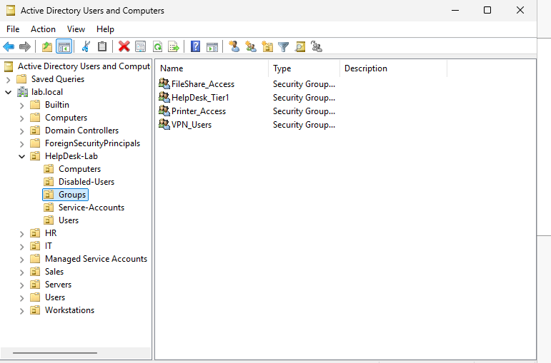

---

# Password Reset Administration

Reset user passwords using PowerShell.

```powershell
Set-ADAccountPassword muser -Reset `
-NewPassword (ConvertTo-SecureString "Welcome123!" -AsPlainText -Force)
```

### Skills Demonstrated

- Password resets
- User support
- Identity management

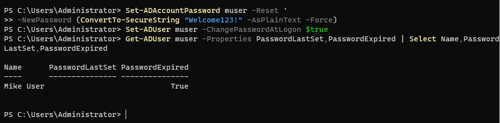

---

# Account Lockout Investigation

Simulated and resolved locked user accounts.

```powershell
Search-ADAccount -LockedOut -UsersOnly
Unlock-ADAccount muser
```

### Skills Demonstrated

- Account unlocks
- User troubleshooting
- Identity support

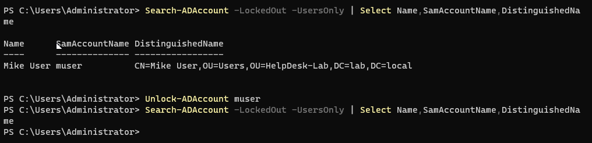

---

# Group Policy Administration

Configured security policies including:

- Screen saver timeout
- Password-protected screen saver

### Skills Demonstrated

- Group Policy Management
- Security policy deployment
- Windows administration

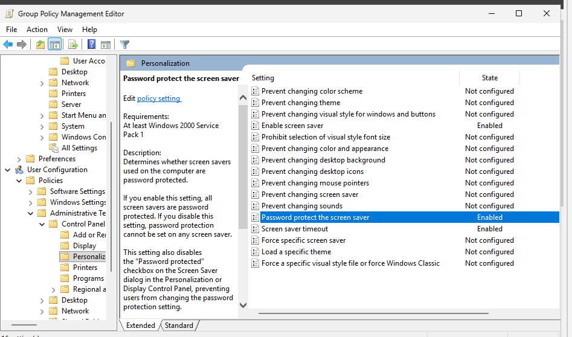

---

# Group Policy Deployment

Applied policy changes.

```powershell
gpupdate /force
```

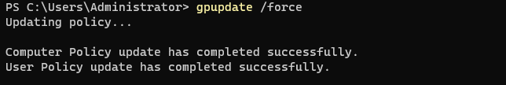

---

# Group Policy Verification

Validated policy application using GPResult.

```powershell
gpresult /r
```

### Skills Demonstrated

- Policy validation
- Troubleshooting
- Endpoint administration

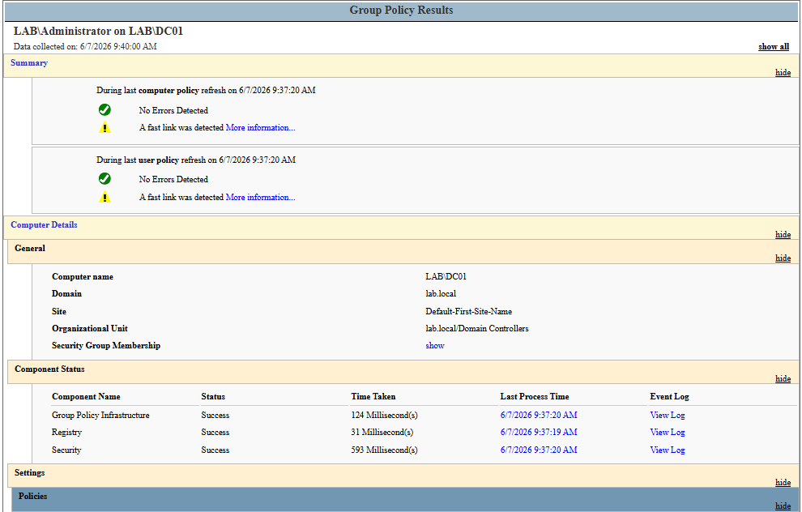

---

# Domain Login Validation

Successfully authenticated to the Active Directory domain.

```powershell
whoami
```

Result:

```text
lab\administrator
```

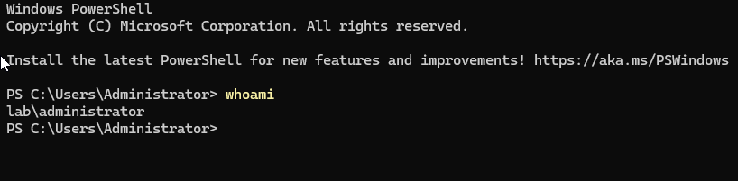

---

# Security Group Validation

Verified domain security group membership.

```powershell
whoami /groups
```

### Skills Demonstrated

- Group membership validation
- Access control verification

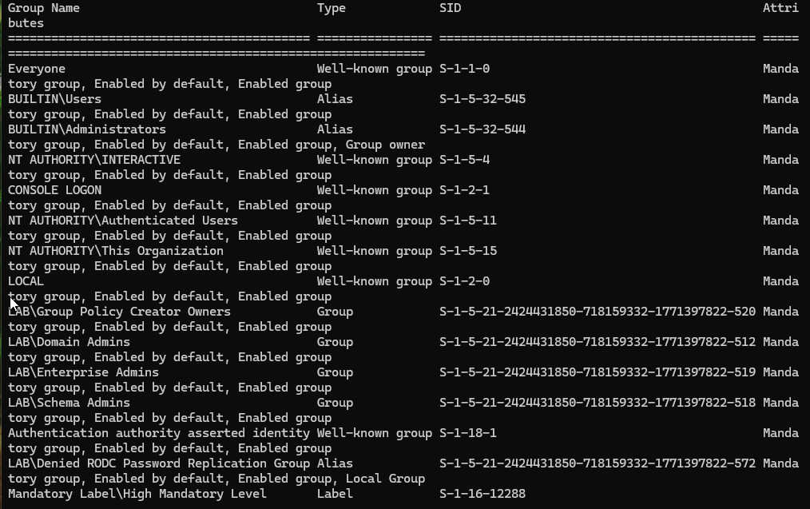

---

# DNS Troubleshooting

Troubleshot DNS resolution issues.

Identified:

- Incorrect DNS server configuration
- Name resolution failures
- Domain lookup issues

Commands used:

```powershell
nslookup
ipconfig /all
ping dc01.lab.local
```

### Skills Demonstrated

- DNS troubleshooting
- Network diagnostics
- Endpoint support

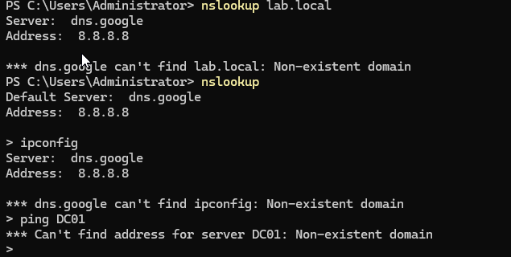

---

# File Share Administration

Created and tested shared folders.

Share:

```text
\\DC01\HelpDesk
```

Tested access from domain user accounts.

### Skills Demonstrated

- SMB shares
- Permissions management
- Access validation

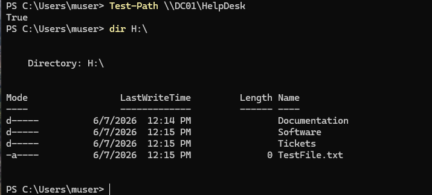

---

# Active Directory Reporting

Generated user and group membership reports.

### Export Users

```powershell
Get-ADUser -Filter * `
-SearchBase "OU=Users,OU=HelpDesk-Lab,DC=lab,DC=local" |
Select Name,SamAccountName,Enabled |
Export-Csv C:\HelpDesk-Users.csv -NoTypeInformation
```

### Export Group Membership

```powershell
Get-ADGroupMember HelpDesk_Tier1 |
Select Name,SamAccountName,ObjectClass |
Export-Csv C:\HelpDesk-GroupMembers.csv -NoTypeInformation
```

### Skills Demonstrated

- PowerShell automation
- Reporting
- Active Directory auditing

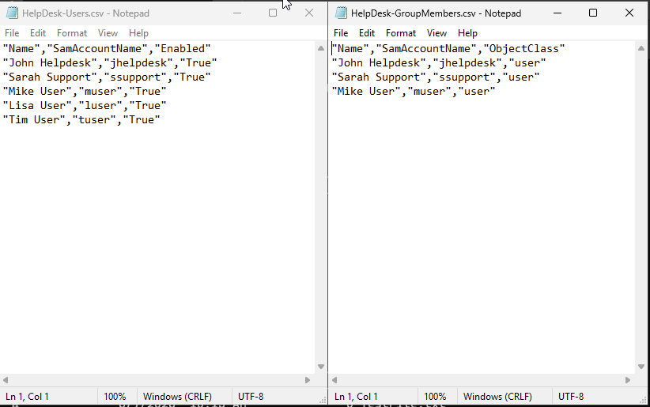

---

# Troubleshooting Scenarios

## DNS Resolution Failure

### Symptoms

```text
Cannot find DC01
Cannot locate domain controller
```

### Root Cause

Incorrect DNS server configuration.

### Resolution

Configured client DNS to point to:

```text
192.168.56.10
```

---

## Domain Join Failure

### Symptoms

```text
The username or password is incorrect
```

### Root Cause

Client was not properly communicating with domain services.

### Resolution

Validated:

- DNS
- LDAP connectivity
- Domain controller discovery
- Time synchronization

Commands:

```powershell
nltest /dsgetdc:lab.local
w32tm /resync
```

---

## Shared Folder Access Issues

### Symptoms

```text
Access denied
```

### Root Cause

Permissions and group membership configuration.

### Resolution

Verified:

- Share permissions
- NTFS permissions
- Security group membership

Commands:

```powershell
Get-SmbShareAccess
Get-ADGroupMember
```

---

# Skills Demonstrated

- Active Directory Administration
- Windows Server Administration
- Windows 11 Support
- DNS Troubleshooting
- Group Policy Management
- Password Resets
- Account Unlocks
- Security Groups
- PowerShell
- File Share Administration
- User Support
- Help Desk Operations
- Access Control
- IT Troubleshooting
- Endpoint Administration

---

# Resume Highlights

- Built and administered a Windows Server 2025 Active Directory environment.
- Created organizational units, users, computers, and security groups.
- Managed password resets, account lockouts, and user access.
- Implemented Group Policy security settings and validated deployment.
- Configured SMB file shares and permission management.
- Troubleshot DNS, authentication, and domain connectivity issues.
- Generated Active Directory reports using PowerShell automation.

---

# Author

**Brandon Cooper**

Aspiring IT Support | Help Desk | System Administration | Cybersecurity

GitHub:
https://github.com/brandonjcooper1981-code

LinkedIn:
https://www.linkedin.com/in/brandon-cooper-070526375
